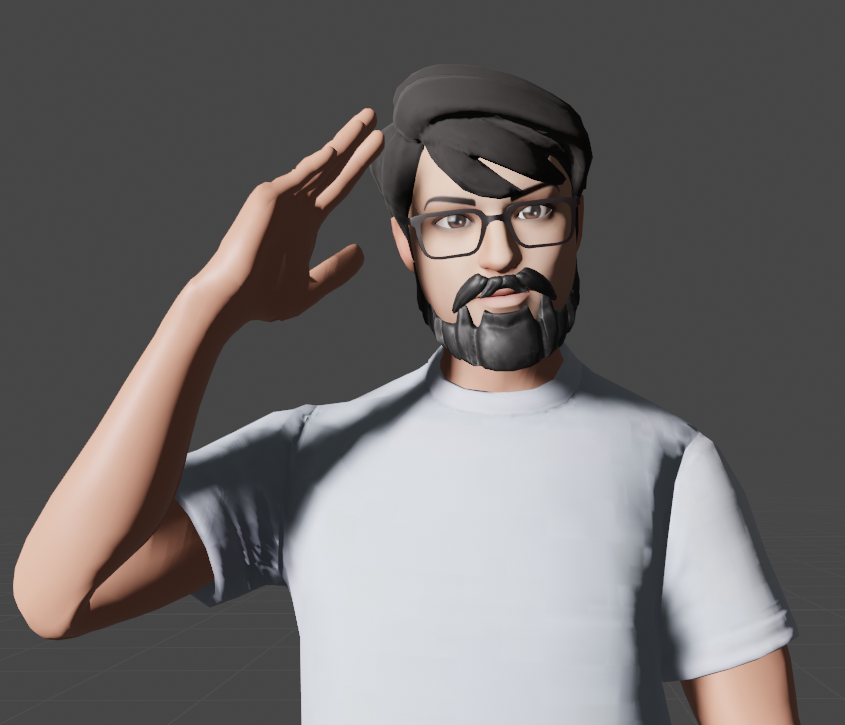

<!-- Improved compatibility of back to top link: See: https://github.com/othneildrew/Best-README-Template/pull/73 -->
<a name="readme-top"></a>
<!--
*** Thanks for checking out the Best-README-Template. If you have a suggestion
*** that would make this better, please fork the repo and create a pull request
*** or simply open an issue with the tag "enhancement".
*** Don't forget to give the project a star!
*** Thanks again! Now go create something AMAZING! :D
-->

<!-- PROJECT SHIELDS -->
<!--
*** I'm using markdown "reference style" links for readability.
*** Reference links are enclosed in brackets [ ] instead of parentheses ( ).
*** See the bottom of this document for the declaration of the reference variables
*** for contributors-url, forks-url, etc. This is an optional, concise syntax you may use.
*** https://www.markdownguide.org/basic-syntax/#reference-style-links
-->
[![Contributors][contributors-shield]][contributors-url]
[![Forks][forks-shield]][forks-url]
[![Stargazers][stars-shield]][stars-url]
[![Issues][issues-shield]][issues-url]
[![MIT License][license-shield]][license-url]
[![LinkedIn][linkedin-shield]][linkedin-url]

<!-- PROJECT LOGO -->
<br />
<div align="center">
    <a href="https://github.com/suweed/portafolio">
        
    </a>
    <h3 align="center">Configurador de Productos</h3>
    <p align="center">
        Configurador de productos para mostrar variaciones de un producto,
        selector de colores, material, piezas
        <br />
        <a href="https://github.com/suweed/portafolio"><strong>Explore the docs »</strong></a>
        <br />
        <br />
        <a href="https://github.com/suweed/portafolio">View Demo</a>
        ·
        <a href="https://github.com/suweed/portafolio/issues">Report Bug</a>
        ·
        <a href="https://github.com/suweed/portafolio/issues">Request Feature</a>
    </p>
</div>

<!-- TABLE OF CONTENTS -->
<details>
  <summary>Table of Contents</summary>
  <ol>
    <li>
      <a href="#about-the-project">About The Project</a>
      <ul>
        <li><a href="#built-with">Built With</a></li>
      </ul>
    </li>
    <li>
      <a href="#getting-started">Getting Started</a>
      <ul>
        <li><a href="#prerequisites">Prerequisites</a></li>
        <li><a href="#installation">Installation</a></li>
      </ul>
    </li>
    <li><a href="#contact">Contact</a></li>
  </ol>
</details>

<!-- ABOUT THE PROJECT -->
## About The Project

[![Product Name Screen Shot][product-screenshot]](https://example.com)

Portafolio personalizado "Jesus Cardozo" tiene 4 paginas Home, About, Work, Contact donde se muestra la inforamcion
del tiempo y trabajo como desarrollador fullstack

<p align="right">(<a href="#readme-top">volver al principio</a>)</p>

### Built With

* [![React][React.js]][React-url]
* [![Three][Threejs]][Three-url]
* [![Javascript][Javascript]][Javascript-url]

<p align="right">(<a href="#readme-top">volver al principio</a>)</p>

<!-- GETTING STARTED -->
## Getting Started

Proyecto basico usando React y javascript, con npm se instalaron las librerias de three @react-three/drei @react-three/fiber @react-three/postprocessing framer-motion react-dom react-i18next use-local-storage valtio web-vitals wouter

### Prerequisites

* node
  - https://nodejs.org/es
* npm
  - https://www.npmjs.com/
  ```sh
  npx create-react-app portafolio
  npm start
  ```

### Installation

1. Clone the repo
   ```sh
   git clone https://github.com/suweed/portafolio.git
   ```
2. Install NPM packages
   ```sh
   npm install
   ```
3. start project
   ```npm
   npm start
   ```

<p align="right">(<a href="#readme-top">volver al principio</a>)</p>

<!-- LICENSE -->
## License

Distribuido bajo la licencia MIT. Consulte `LICENCIA.txt` para obtener más información.

<p align="right">(<a href="#readme-top">volver al principio</a>)</p>

<!-- CONTACT -->
## Contact

Jesús Cardozo - [@dRsUgAr1221](https://twitter.com/dRsUgAr1221) - gsuskr2o@gmail.com

Project Link: [https://github.com/suweed/portafolio](https://github.com/suweed/portafolio)

<p align="right">(<a href="#readme-top">volver al principio</a>)</p>

<!-- MARKDOWN LINKS & IMAGES -->
<!-- https://www.markdownguide.org/basic-syntax/#reference-style-links -->
[contributors-shield]: https://img.shields.io/github/contributors/suweed/configurator.svg?style=for-the-badge
[contributors-url]: https://github.com/suweed/portafolio/graphs/contributors
[forks-shield]: https://img.shields.io/github/forks/suweed/configurator.svg?style=for-the-badge
[forks-url]: https://github.com/suweed/portafolio/network/members
[stars-shield]: https://img.shields.io/github/stars/suweed/configurator.svg?style=for-the-badge
[stars-url]: https://github.com/suweed/portafolio/stargazers
[license-shield]: https://img.shields.io/github/license/suweed/configurator.svg?style=for-the-badge
[license-url]: https://github.com/suweed/portafolio/blob/main/LICENSE.txt
[issues-shield]: https://img.shields.io/github/issues/suweed/configurator.svg?style=for-the-badge
[issues-url]: https://github.com/suweed/portafolio/issues
[linkedin-shield]: https://img.shields.io/badge/-LinkedIn-black.svg?style=for-the-badge&logo=linkedin&colorB=555
[linkedin-url]: https://linkedin.com/in/gsuskr2o
[product-screenshot]: public/images/screen.gif
[React.js]: https://img.shields.io/badge/React-20232A?style=for-the-badge&logo=react&logoColor=61DAFB
[React-url]: https://reactjs.org/
[Threejs]: https://img.shields.io/badge/three-20232A?style=for-the-badge&logo=threedotjs
[Three-url]: https://threejs.org/
[Javascript]: https://img.shields.io/badge/javascript-20232A?style=for-the-badge&logo=javascript
[Javascript-url]: https://lenguajejs.com/javascript/
